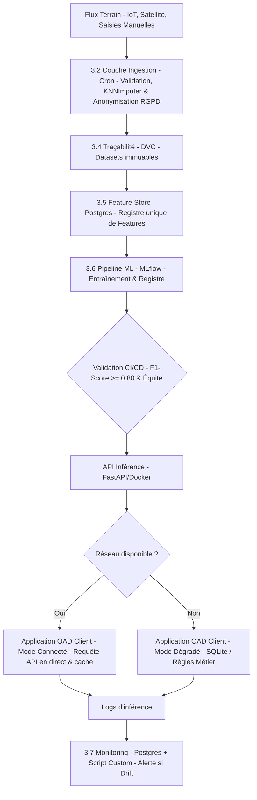

# Étape 5 — Évolution de l’architecture

## 1. Objectif de l’évolution

Cette étape vise à consolider les constats issus des étapes 1 à 4 afin de faire évoluer l’architecture actuelle vers une plateforme de données et de Machine Learning :

* robuste aux biais et aux dérives statistiques
* conforme RGPD et AI Act
* extensible aux nouvelles sources (IoT, satellite, météo)
* industrialisable (MLOps-ready)

L’architecture ne doit plus seulement “fonctionner”, mais **garantir la fiabilité, la traçabilité et la gouvernance des décisions IA**.

---

## 2. Synthèse des constats critiques (Étapes 1 à 4)

### 2.1 Données hétérogènes et instables

* Sources multiples : IoT, satellite, drone, manuel
* Qualité variable selon capteurs et régions
* Données manquantes (~5%) et aberrantes (NDVI, météo)

Conséquence : nécessité d’une couche de validation et standardisation forte dès l’ingestion

---

### 2.2 Risques de biais structurels

* Déséquilibre des cultures (majoritaires vs minoritaires)
* Inégalités géographiques de couverture
* Hétérogénéité des capteurs

Conséquence : le modèle global masque des injustices locales (problème de fairness)

---

### 2.3 Problèmes de conformité et de gouvernance

* Présence initiale de données PII (Exploitants, SIRET, contacts)
* Risque de profilage humain indirect
* Enjeux RGPD et dérives de surveillance

Conséquence : nécessité d’un pipeline “Privacy by Design” strict

---

### 2.4 Limites du modèle ML actuel

* Sensibilité aux outliers (NDVI, météo)
* Risque de surapprentissage sur identifiants indirects
* Difficulté de généralisation inter-régions et inter-cultures

Conséquence : besoin d’un système MLOps avec monitoring continu

---

## 3. Architecture cible proposée

### 3.1 Vue globale

Pour transposer le travail exploratoire du notebook vers un système de production robuste, l'architecture cible s'articule autour d'un écosystème modulaire et découplé. Plutôt que de s'appuyer sur des orchestrateurs tiers ou des plateformes lourdes, elle privilégie des scripts Python autonomes, une automatisation par tâches planifiées (Cron / CI-CD) et une stratégie applicative Offline-First.

---

### 3.2 Couche d’ingestion (renforcée)

**objectif :** Assurer la qualité, la conformité réglementaire et la standardisation des flux de données entrants (IoT, satellite, météo, manuels) avant tout traitement applicatif ou stockage.

**Description :** L'ingestion est pilotée par un script Python autonome (data_validation.py) exécuté périodiquement (ex: via un Cron job Linux). Ce script filtre activement les données aberrantes issues des capteurs ou des erreurs de saisie manuelle. Il applique de manière industrialisée l'algorithme KNNImputer validé à l'étape 2 pour traiter les ~5% de données manquantes, garantissant un flux propre et normalisé.

---

### 3.3 Couche de gouvernance et sécurité

**objectif :** Garantir une conformité absolue avec le RGPD (Privacy by Design) et anticiper les exigences de l'AI Act en matière de maîtrise des risques et d'équité (Fairness).

**Description :** Dès l'entrée dans la couche d'ingestion, un module de nettoyage anonymise les données en purgeant définitivement les variables PII identifiées à l'étape 2 (noms d'exploitants, numéros SIRET, contacts téléphoniques), ne conservant que des identifiants techniques. De plus, lors de la phase de validation du modèle, des tests d'équité sont exécutés pour s'assurer que le modèle ne discrimine pas une région ou une culture minoritaire.

---

### 3.4 Traçabilité

**objectif :** Assurer l'auditabilité et la reproductibilité complète du système en scellant de manière immuable les relations entre le code source, les jeux de données et les paramètres des modèles.

**Description :** La traçabilité repose sur un versionnage dual. D'une part, DVC (Data Version Control) fige l'état des datasets (bruts et nettoyés) sur le stockage de fichiers sans encombrer Git. D'autre part, MLflow centralise l'historique des cycles d'entraînement (suivi des hyperparamètres Optuna, courbes de performance et artefacts du Random Forest), répondant directement aux obligations de documentation technique de l'AI Act.

---

### 3.5 Feature Store (nouveau composant critique)

**objectif :** Centraliser, documenter et servir les caractéristiques calculées (ex: les 5+ métriques agrégées de NDVI et de météo créées à l'étape 2) afin d'éliminer définitivement le risque de décalage entre la phase d'entraînement et la phase d'inférence (training-serving skew).

**Description :** Implémenté de manière légère via des tables dédiées dans une base de données relationnelle (PostgreSQL), le Feature Store fait office de "source unique de vérité". Le script d'entraînement et l'API d'inférence interrogent ce même composant pour consommer des caractéristiques calculées selon la même logique mathématique, évitant ainsi que le modèle reçoive en production des variables construites différemment de celles de son apprentissage.

---

### 3.6 Pipeline ML industrialisé

**objectif :** Automatiser la validation et le déploiement continu du modèle tout en garantissant la haute disponibilité et la résilience de l'Outil d'Aide à la Décision (OAD) sur le terrain.

**Description :** Lorsqu'un réentraînement est déclenché, un pipeline de CI/CD (ex: GitHub Actions) évalue le modèle Random Forest candidat. S'il respecte les contraintes ($F1\text{-Score} \ge 0.80$ et critères d'équité), il est promu dans le registre MLflow. Le déploiement s'appuie sur une API légère FastAPI conteneurisée avec Docker.

Pour pallier l'indisponibilité du réseau en zone rurale (zones blanches), l'application cliente adopte une approche Offline-First : elle embarque un cache local (SQLite). Si l'API centrale est injoignable, l'application bascule instantanément en mode dégradé en exploitant les prédictions en cache ou des règles métiers de secours.

---

### 3.7 Monitoring en production

**objectif :** Surveiller en continu le comportement du modèle et détecter les dérives statistiques (Data Drift) liées au climat ou à l'usure des capteurs, sans déployer d'infrastructure logicielle tierce.

**Description :** Toutes les requêtes d'inférence et les prédictions de l'API FastAPI sont journalisées dans une table de logs PostgreSQL. Un script Python autonome (check_drift.py) s'exécute de manière hebdomadaire pour comparer la distribution des données réelles récentes à celle du jeu d'entraînement d'origine à l'aide de calculs statistiques standards (scipy.stats et numpy). En cas de dérive majeure ou de baisse constatée des performances sous le seuil des $0.80$, une alerte critique est émise, ajustant le seuil de décision de l'API par sécurité et planifiant un cycle de réentraînement.

---

## 4. Principes architecturaux retenus

**Sobriété et Pragmatisme Logiciel :** Rejet des usines à gaz d'orchestration ou de monitoring tierces. L'architecture maximise l'utilisation de scripts Python natifs, de tâches planifiées standards et de librairies scientifiques éprouvées (scipy, numpy), réduisant drastiquement les coûts de maintenance et l'empreinte infrastructure.

**Résilience Absolue (Offline-First) :** Conception pensée prioritairement pour l'utilisateur final en zone blanche rurale. La séparation stricte entre le serveur d'inférence (FastAPI) et le client autonome (cache SQLite local) garantit la continuité de l'aide à la décision sur le terrain, même sans couverture réseau.

**Sécurité et Éthique par Conception (By Design) :** Intégration native des contraintes du RGPD (anonymisation immédiate des PII à l'ingestion) et de l'AI Act (garde-fous de performance, d'équité locale et traçabilité DVC/MLflow) directement dans les étapes automatisées du pipeline.

**Modularité et Unicité de la Donnée :** Grâce à l'introduction du Feature Store, la logique de préparation de la donnée est isolée de la logique de modélisation, garantissant qu'une caractéristique (feature) possède la même définition, qu'elle serve à l'apprentissage ou à la prédiction en direct.

---

## 5. Conclusion

L'évolution d'architecture proposée transforme avec succès un travail de R&D initialement confiné dans un notebook Jupyter en une plateforme industrielle capitalisant sur les forces du modèle Random Forest et de l'écosystème MLflow / DVC.

En apportant des réponses pragmatiques et légères aux constats critiques des premières étapes—notamment le traitement des biais de capteurs, le respect strict du RGPD, et la mise en place d'un mode dégradé performant pour parer aux coupures réseau—cette architecture garantit la viabilité opérationnelle de l'OAD. Elle offre au jury la vision d'un système robuste, économe en ressources, conforme aux réglementations européennes majeures (AI Act), et résolument ancré dans les réalités et contraintes du monde agricole sur le terrain.
